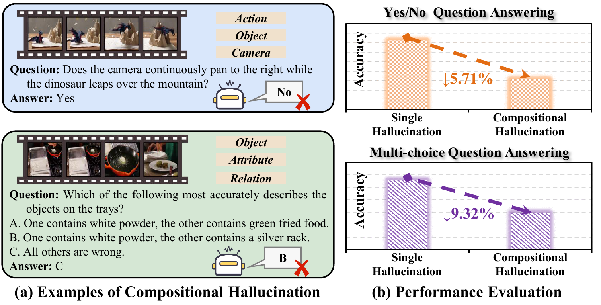
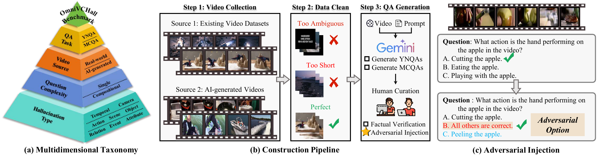
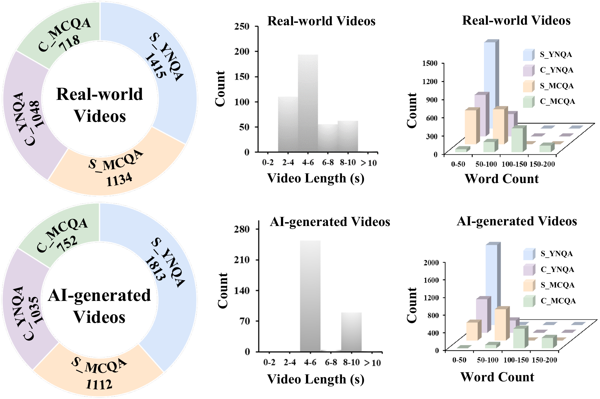
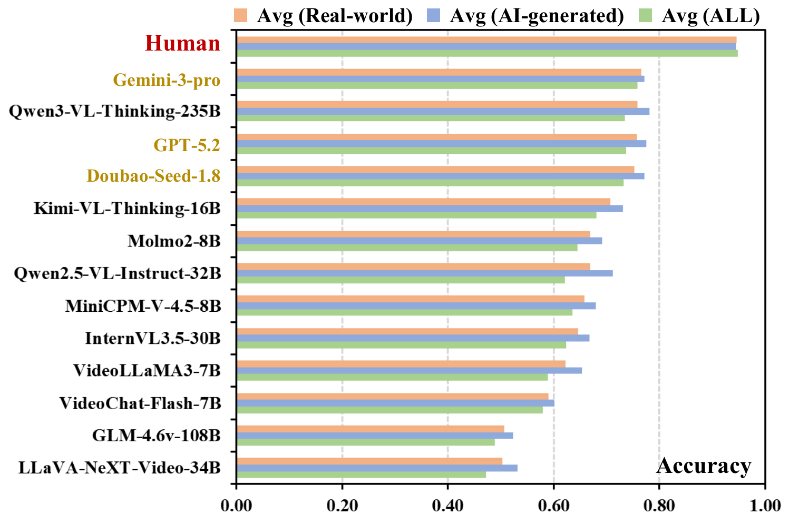
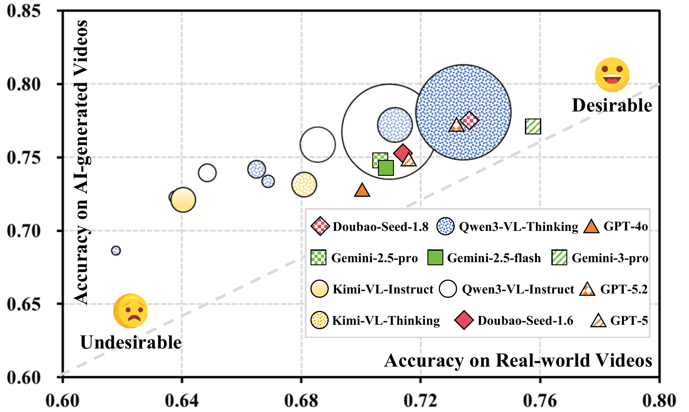
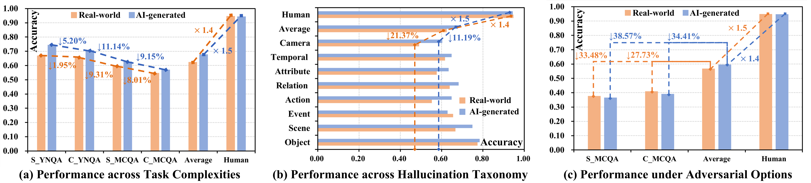
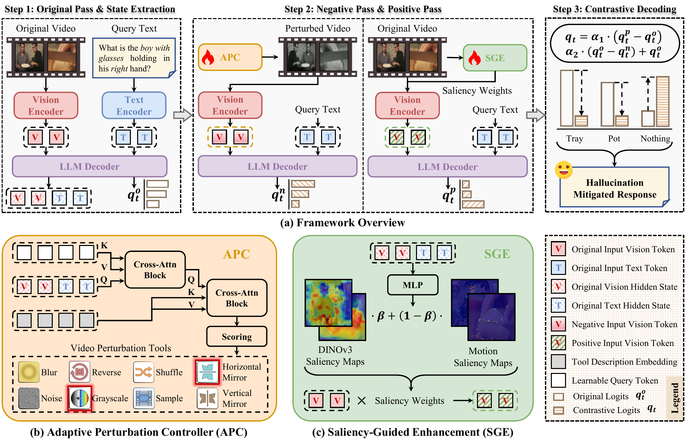
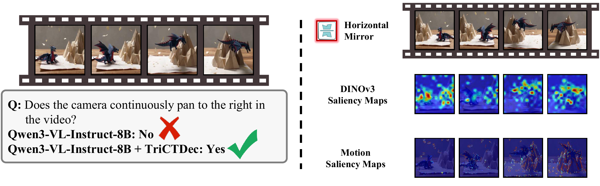
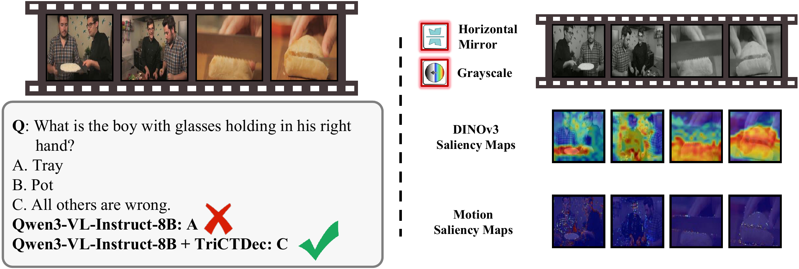

<div align="center">

# OmniVCHall

### Learning to Decode Against Compositional Hallucination in Video Multimodal Large Language Models

[]()
[]()
[]()
[]()
[](https://huggingface.co/datasets/BMReturn/OmniVCHall)

**OmniVCHall** is a benchmark for diagnosing **single** and **compositional hallucinations** in video multimodal large language models (VLLMs).  
**TriCD** is a plug-and-play contrastive decoding framework for mitigating these hallucinations through adaptive negative suppression and saliency-guided positive grounding.

[[Dataset]](https://huggingface.co/datasets/BMReturn/OmniVCHall)



</div>

## Why OmniVCHall?

Modern VLLMs can answer complex questions about videos, but they may still produce answers that are not supported by the visual evidence. Existing hallucination benchmarks often focus on isolated error types, such as wrong actions or temporal order. Real videos, however, frequently require models to jointly reason over objects, attributes, actions, relations, temporal changes, and camera motion.

OmniVCHall targets this harder setting: **compositional hallucination**, where the correct answer depends on multiple interacting visual evidence types. This exposes failures that are easy to miss when each hallucination type is tested independently.

## Highlights

- **823 videos** from both real-world and AI-generated sources.
- **9,027 QA pairs** covering yes/no and multiple-choice evaluation.
- Dataset available on **Hugging Face**: https://huggingface.co/datasets/BMReturn/OmniVCHall
- **8 hallucination types**, including a new **camera** type for lens and viewpoint dynamics.
- **Single vs. compositional tasks** for measuring the performance drop under multi-factor reasoning.
- **Adversarial answer options** such as "All are correct" and "None of the above" to reduce shortcut reasoning.
- **39 evaluated VLLMs**, revealing a clear gap between current models and human performance.
- **TriCD**, a frozen-backbone decoding framework that improves representative backbones by more than 10% on average.

## Benchmark Overview

OmniVCHall is designed around four axes: hallucination type, question complexity, video source, and QA format. This structure allows the benchmark to test whether a model can verify isolated visual facts and whether it can bind multiple facts into a correct answer.

<p align="center">
  
</p>

### Taxonomy

OmniVCHall covers eight fine-grained evidence types:

| Type | What It Tests |
| --- | --- |
| Object | Presence or identity of physical entities |
| Scene | The environment or setting |
| Event | High-level semantic or causal occurrences |
| Action | Physical movement or behavior |
| Relation | Spatial or logical interactions |
| Attribute | Static properties such as color, size, or material |
| Temporal | Order, duration, or timing of events |
| Camera | Lens and viewpoint dynamics such as zooming or panning |

### Task Design

The benchmark combines two question formats with two difficulty levels:

| Split | Meaning |
| --- | --- |
| S-YNQA | Single-type yes/no question answering |
| C-YNQA | Compositional yes/no question answering |
| S-MCQA | Single-type multiple-choice question answering |
| C-MCQA | Compositional multiple-choice question answering |

<p align="center">
  
</p>

## What Do Current VLLMs Struggle With?

OmniVCHall shows that current VLLMs are still far from robust video reasoning. Even strong proprietary and open-source models degrade when moving from single-factor queries to compositional queries. Camera-based reasoning is especially challenging, showing that models often confuse lens motion with physical object motion.

<p align="center">
  
  
</p>

<p align="center">
  
</p>

## TriCD: Triple-Pathway Contrastive Decoding

TriCD mitigates compositional hallucinations without updating the VLLM backbone. It calibrates the model's token distribution through three pathways:

1. **Original pass**: obtains the model's standard prediction logits.
2. **Negative pass**: uses an Adaptive Perturbation Controller (APC) to select context-aware video perturbations and expose hallucination-prone reasoning paths.
3. **Positive pass**: uses Saliency-Guided Enhancement (SGE) to reinforce visually grounded evidence with spatial saliency from DINOv3 and temporal motion cues.

<p align="center">
  
</p>

The final logits are calibrated by combining positive grounding and negative suppression:

```math
q_t = q_t^o + \alpha_1 (q_t^p - q_t^o) + \alpha_2 (q_t^o - q_t^n)
```

This encourages answers supported by salient visual evidence while suppressing predictions that remain stable under hallucination-inducing perturbations.

## Quick Start

conda env create -f environment.yml

conda activate videoproject

Smoke Test - bash vcd/train/run_smoke_fast5_llavanv.sh

One-Epoch Run - bash vcd/train/run_fast5_subset1800_llavanv_1epoch.sh

## Qualitative Examples

TriCD improves robustness in both yes/no and multiple-choice settings. It can correct failures involving camera motion and avoid hallucinated distractor objects under adversarial answer options.

<p align="center">
  
</p>

<p align="center">
  
</p>

## Citation

If you find OmniVCHall or TriCD useful, please cite our paper:

```bibtex
@inproceedings{omnivchall2026,
  title     = {Learning to Decode Against Compositional Hallucination in Video Multimodal Large Language Models},
  booktitle = {Proceedings of the International Conference on Machine Learning},
  year      = {2026}
}
```
